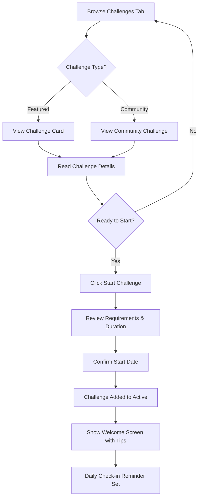
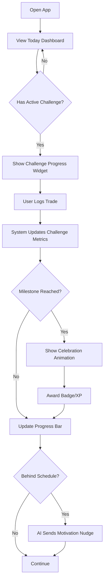
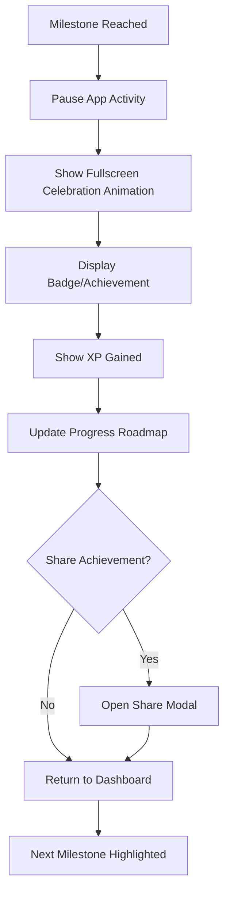
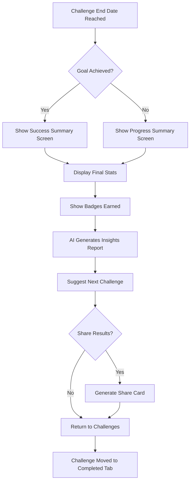

# TradeJournal Challenges & Goals Module
## Complete Feature Specification

---

## 🎯 Marketing Pitch

**"Turn Your Trading Journey Into An Achievable Quest"**

Challenges & Goals transforms your trading improvement from a vague ambition into a gamified journey with clear milestones, instant feedback, and rewarding achievements. Whether you're chasing 10% monthly growth, perfecting your risk-reward ratio, or building unbreakable discipline—every trade becomes a step forward in your personalized quest. Compete with yourself, celebrate wins with badges and XP, get AI-powered course corrections when you drift off track, and optionally share your progress with a community of traders on the same path. No more aimless trading—just clear goals, real progress, and proven results.

---

## 📋 Table of Contents
1. [Overview](#overview)
2. [Challenge Types](#challenge-types)
3. [User Flows](#user-flows)
4. [UI/UX Specifications](#uiux-specifications)
5. [Gamification System](#gamification-system)
6. [Adaptive & Dynamic Behavior](#adaptive-dynamic-behavior)
7. [Social & Sharing Features](#social-sharing-features)
8. [Integration Points](#integration-points)
9. [Sample Challenge Templates](#sample-challenge-templates)
10. [Technical Architecture](#technical-architecture)

---

## 1. Overview

### Core Philosophy
- **Motivational, not punitive**: Challenges encourage growth without harsh penalties
- **Clear progress tracking**: Users always know where they stand
- **Achievable milestones**: Break big goals into smaller wins
- **Adaptive difficulty**: System adjusts based on performance
- **Social motivation**: Optional community features for accountability

### Key Components
1. **Challenge Library**: Pre-built templates + community challenges
2. **Progress Dashboard**: Real-time tracking with visual feedback
3. **Milestone System**: Break goals into achievable steps
4. **Reward Engine**: Badges, XP, unlocks, and achievements
5. **AI Coach**: Adaptive suggestions and course corrections
6. **Social Layer**: Sharing, leaderboards, group challenges

---

## 2. Challenge Types

### 2.1 Compounding Challenges
**Goal**: Achieve specific account growth percentage over time

**Examples**:
- "10% in 30 Days Sprint"
- "Double Your Account in 90 Days"
- "Steady 5% Monthly Grower"

**Metrics Tracked**:
- Current account balance vs. starting balance
- Daily/weekly growth rate
- Consistency of positive days
- Compounding rate

**Failure Conditions**:
- Missing growth target by >20% at end date
- Account drawdown exceeds safety threshold (e.g., -15%)

**Success Rewards**:
- Growth Master Badge (Bronze/Silver/Gold tiers)
- XP based on difficulty
- Unlock advanced analytics features

---

### 2.2 Risk-Reward (R:R) Improvement Challenges
**Goal**: Improve average R:R ratio over set number of trades

**Examples**:
- "R:R Excellence: 1.0 → 1.5 in 100 trades"
- "3:1 Master: Achieve 3:1 R:R for 50 trades"
- "Stop-Loss Optimizer: Reduce average loss size by 20%"

**Metrics Tracked**:
- Average R:R per trade
- Trend line of R:R over time
- Number of trades with R:R > target
- Stop-loss discipline adherence

**Failure Conditions**:
- R:R average drops below starting point
- Abandoning stop-loss discipline

**Success Rewards**:
- Precision Trader Badge
- R:R Mastery Certificate
- Unlock risk management tools

---

### 2.3 Win Rate Challenges
**Goal**: Maintain win rate above threshold for duration

**Examples**:
- "Perfect Week: 60%+ for 7 days"
- "Consistency King: 55%+ for 30 days"
- "Accuracy Sprint: 70%+ for 20 trades"

**Metrics Tracked**:
- Daily/weekly win rate
- Consecutive winning/losing days
- Win rate by trading session
- Trade quality score

**Failure Conditions**:
- Win rate drops below threshold for 3+ consecutive days
- Total trades below minimum required

**Success Rewards**:
- Consistency Badge
- Win Rate Champion Trophy
- Unlock advanced pattern recognition

---

### 2.4 Streak Challenges
**Goal**: Maintain positive trading activity streaks

**Examples**:
- "30 Day Trading Streak: Log 1+ trade daily"
- "Profitable Streak: 10 consecutive profitable days"
- "Journal Master: 14 days of detailed notes"

**Metrics Tracked**:
- Current streak length
- Longest streak achieved
- Streak recovery after breaks
- Quality of logged data

**Failure Conditions**:
- Missing a day breaks the streak
- Trades logged without proper notes

**Success Rewards**:
- Streak Master Badge (with flame icon 🔥)
- XP multipliers for continued streaks
- Priority access to new features

---

### 2.5 Drawdown Control Challenges
**Goal**: Keep maximum drawdown under specific threshold

**Examples**:
- "Drawdown Guardian: <5% for 30 days"
- "Risk Manager: <10% max drawdown for 60 days"
- "Capital Protector: Never lose >3% in single day"

**Metrics Tracked**:
- Current drawdown percentage
- Maximum drawdown reached
- Days without exceeding threshold
- Recovery time from drawdowns

**Failure Conditions**:
- Drawdown exceeds threshold at any point
- Pattern of approaching limit repeatedly

**Success Rewards**:
- Risk Master Badge
- Premium AI insights unlock
- Capital Guardian Achievement

---

## 3. User Flows

### 3.1 Starting a Challenge



**Key Steps**:
1. User navigates to Challenges tab
2. Browses featured or community challenges
3. Taps challenge card to see full details
4. Reviews goal, duration, rewards, difficulty
5. Confirms start → Challenge moves to "Active"
6. Receives welcome notification with first milestone
7. Daily reminder push notifications enabled

---

### 3.2 Daily Progress Check-In



**Key Steps**:
1. User opens app to Today view
2. Challenge progress widget visible at top
3. As trades logged, progress auto-updates
4. If milestone hit → celebration modal appears
5. If falling behind → AI coach sends encouraging suggestion
6. Progress always visible on home screen

---

### 3.3 Milestone Achievement Flow



**Visual Elements**:
- Confetti animation
- Badge reveal with shine effect
- XP counter rolling up
- Progress bar filling with animation
- Sound effect (optional, user can disable)

---

### 3.4 Challenge Completion Flow



**Summary Screen Elements**:
- Final progress percentage
- Stats comparison (start vs. end)
- Badges and achievements earned
- AI-generated key insights
- Suggested next challenge
- Share button for social

---

## 4. UI/UX Specifications

### 4.1 Challenge Selection Screen

**Layout**:
```
┌─────────────────────────────────────┐
│  🏆 Challenges         [+ Create]   │
├─────────────────────────────────────┤
│  Stats Bar:                         │
│  12 Completed | 1 Active | 2450 XP  │
├─────────────────────────────────────┤
│  [Active] [Browse] [Completed]      │
├─────────────────────────────────────┤
│  ┌─────────────────────────────┐   │
│  │  Challenge Card             │   │
│  │  ┌─────┐  10% Growth Sprint │   │
│  │  │ 📈  │  30 days            │   │
│  │  └─────┘  [Intermediate]    │   │
│  │                              │   │
│  │  Goal: 10% account growth    │   │
│  │  Reward: Growth Badge + XP   │   │
│  │  👥 156 participants         │   │
│  │                              │   │
│  │  [Start Challenge]           │   │
│  └─────────────────────────────┘   │
│                                     │
│  [Load More Challenges...]          │
└─────────────────────────────────────┘
```

**Challenge Card Components**:
- Icon representing challenge type
- Title and duration
- Difficulty badge (Beginner/Intermediate/Advanced/Expert)
- Short description
- Goal statement
- Reward preview
- Participant count (for community challenges)
- CTA button (Start/View)

**Interaction**:
- Tap card to expand full details
- Swipe cards horizontally (mobile)
- Filter by type, difficulty, duration
- Search functionality

---

### 4.2 Challenge Progress Dashboard

**Layout**:
```
┌─────────────────────────────────────┐
│  ← 10% Growth Sprint      [•••]     │
├─────────────────────────────────────┤
│  ┌─────────────────────────────┐   │
│  │     67%                      │   │
│  │  [██████████░░░]            │   │
│  │                              │   │
│  │  🔥 12 Day Streak            │   │
│  │  📅 Dec 5 - Jan 4            │   │
│  └─────────────────────────────┘   │
├─────────────────────────────────────┤
│  🎯 Next Milestone               │
│  ┌─────────────────────────────┐   │
│  │  Final Push                  │   │
│  │  Reach 8% account growth     │   │
│  │  [████████░░] 75%            │   │
│  └─────────────────────────────┘   │
├─────────────────────────────────────┤
│  📍 Milestones Roadmap           │
│  ┌─────────────────────────────┐   │
│  │  ✅ First 3% Gained          │   │
│  │  ✅ Halfway There (5%)       │   │
│  │  🎯 Final Push (8%)  75%     │   │
│  │  ○ Challenge Complete (10%)  │   │
│  └─────────────────────────────┘   │
├─────────────────────────────────────┤
│  📊 Performance Stats            │
│  Win Rate: 62% | R:R: 1.8 | +$670│
└─────────────────────────────────────┘
```

**Key Elements**:
- Overall progress circle/bar (prominent)
- Current streak indicator
- Time remaining countdown
- Next milestone card with mini progress bar
- Vertical milestone roadmap with checkmarks
- Quick stats comparison
- Menu button (pause, quit, settings)

**Visual Feedback**:
- Progress bar fills with gradient
- Streak flame icon pulses
- Completed milestones show checkmark animation
- Current milestone highlighted with glow

---

### 4.3 Daily Check-In Screen

**Appears When**:
- User opens app at start of day
- Has active challenge
- Hasn't logged trade yet today

**Layout**:
```
┌─────────────────────────────────────┐
│     Good Morning, Trader! ☀️        │
├─────────────────────────────────────┤
│  Your 10% Growth Sprint             │
│  Day 12 of 30                       │
│                                     │
│  Yesterday: +2.3% ✅                │
│  Today's Goal: Maintain momentum    │
│                                     │
│  ┌─────────────────────────────┐   │
│  │  [Log First Trade]           │   │
│  └─────────────────────────────┘   │
│                                     │
│  💡 AI Tip of the Day:              │
│  "You're performing best on Mon/    │
│   Wed. Consider focusing more       │
│   trades on these days."            │
│                                     │
│  [View Full Dashboard] [Dismiss]    │
└─────────────────────────────────────┘
```

**Elements**:
- Personalized greeting
- Challenge name and day count
- Yesterday's result (if applicable)
- Today's focus goal
- Quick-log trade button
- AI tip/suggestion
- Dismiss or view full option

---

### 4.4 Challenge End Summary Screen

**Layout**:
```
┌─────────────────────────────────────┐
│     🎉 Challenge Complete!          │
├─────────────────────────────────────┤
│  10% Growth Sprint                  │
│                                     │
│  ┌─────────────────────────────┐   │
│  │         67%                  │   │
│  │                              │   │
│  │  🏆 Growth Master Badge      │   │
│  │  +500 XP                     │   │
│  └─────────────────────────────┘   │
├─────────────────────────────────────┤
│  📊 Your Stats                   │
│  ┌───────────────┬─────────────┐   │
│  │ Total Trades  │     45      │   │
│  │ Win Rate      │     62%     │   │
│  │ Avg R:R       │     1.8     │   │
│  │ Total Profit  │    +$670    │   │
│  └───────────────┴─────────────┘   │
├─────────────────────────────────────┤
│  🎯 Key Insights                 │
│  • Win rate improved 8%          │
│  • Best days: Mon & Wed          │
│  • Maintained position sizing    │
│  • Try extending this strategy   │
├─────────────────────────────────────┤
│  [Share Results] [View Badges]   │
│  [Start New Challenge]           │
└─────────────────────────────────────┘
```

**Elements**:
- Success/progress indicator
- Badge reveal animation
- XP awarded with counter animation
- Stats comparison table
- AI-generated insights (3-5 key points)
- Call-to-action buttons

**If Challenge Failed** (didn't reach goal):
- Show "Good Effort!" message instead
- Display actual progress achieved
- AI suggests what to adjust next time
- Offer to retry same challenge

---

## 5. Gamification System

### 5.1 Badges & Achievements

**Badge Categories**:
1. **Progress Badges**: Earned for milestones
   - First Challenge Started
   - First Milestone Reached
   - First Challenge Completed
   - 5/10/25 Challenges Completed

2. **Performance Badges**: Based on trading metrics
   - Growth Master (Bronze/Silver/Gold/Platinum)
   - Precision Trader (R:R excellence)
   - Consistency Champion (Win rate)
   - Risk Guardian (Drawdown control)
   - Streak Master (Daily trading streaks)

3. **Special Badges**: Rare achievements
   - Perfect Month (100% goal achievement)
   - Community Hero (Help 10 traders)
   - AI Approved (Follow AI suggestions 20 times)
   - Comeback King (Recover from failed challenge)

**Badge Design**:
- Metallic finish with shine animation
- Tier-based colors (Bronze/Silver/Gold)
- Icon representing achievement type
- Hover shows earned date and description
- Displayed on profile and can be showcased

---

### 5.2 XP System

**How XP is Earned**:
- Starting a challenge: +50 XP
- Completing milestones: +50-200 XP (based on difficulty)
- Daily trade logged: +10 XP
- Following AI suggestion: +25 XP
- Helping community member: +100 XP
- Completing challenge: +500-2000 XP (based on difficulty)

**XP Multipliers**:
- Streak bonus: +10% per 5-day streak (max 50%)
- Difficulty bonus: Beginner (1x), Intermediate (1.5x), Advanced (2x), Expert (3x)
- Perfect execution: +20% if hit all milestones

**Level System**:
- Level 1-10: Novice Trader (0-5,000 XP)
- Level 11-20: Skilled Trader (5,001-15,000 XP)
- Level 21-30: Expert Trader (15,001-35,000 XP)
- Level 31-40: Master Trader (35,001-70,000 XP)
- Level 41+: Legendary Trader (70,001+ XP)

**Level Benefits**:
- Unlock advanced challenges
- Access premium AI insights
- Custom challenge creation
- Leaderboard ranking boosts
- Exclusive badges

---

### 5.3 Milestone Animations

**On Milestone Achievement**:
1. Screen briefly pauses current activity
2. Confetti animation bursts from center
3. Badge icon scales up with bounce effect
4. XP counter rapidly increments with sound
5. Progress bar fills to next milestone with glow
6. Brief congratulatory message appears
7. Option to share immediately

**Animation Timing**:
- Confetti: 2 seconds
- Badge reveal: 1 second
- XP count-up: 1.5 seconds
- Total: ~5 seconds (skippable)

**Customization**:
- Users can reduce/disable animations
- Sound effects can be muted
- Minimal mode (just notification banner)

---

### 5.4 Notifications & Nudges

**Daily Reminders**:
- "Start your trading day! Log your first trade."
- "You're 2 trades away from your daily goal!"
- "Don't break your 12-day streak! Log today's trades."

**Progress Nudges**:
- "You're 75% to your next milestone! Keep going!"
- "Just 3 more days to complete this challenge!"
- "You're ahead of schedule! Maintain this pace."

**AI Coaching Nudges**:
- "Your win rate dipped yesterday. Review your strategy."
- "Great job! Your R:R improved by 15% this week."
- "Consider taking a break—you've traded 10 days straight."

**Social Nudges**:
- "5 traders in your network completed this challenge!"
- "You're #47 on the leaderboard, 200 XP from #46!"
- "Your friend @TradingPro just earned the Growth Badge!"

**Delivery Channels**:
- In-app banner notifications
- Push notifications (user-controlled)
- Email summaries (weekly, optional)

---

## 6. Adaptive & Dynamic Behavior

### 6.1 AI Performance Monitoring

**What AI Tracks**:
- Progress velocity (are they on track?)
- Performance consistency (stable or volatile?)
- Adherence to trading rules
- Response to previous suggestions
- Trading session times and frequency

**AI Analysis Frequency**:
- Real-time: After every trade logged
- Daily summary: End of trading session
- Weekly review: Every Sunday
- Challenge midpoint: Halfway assessment

---

### 6.2 Adaptive Difficulty Adjustments

**If User is Ahead of Schedule**:
- AI suggests stretch goals
  - "You're crushing it! Consider adding a secondary goal."
  - "You might achieve this early. Want to increase target to 12%?"
- Unlock harder challenges early
- Offer bonus milestones

**If User is Behind Schedule**:
- AI provides encouragement + actionable steps
  - "You're 10% behind, but you can catch up by increasing R:R by 0.2."
  - "Focus on quality over quantity—2-3 high-quality trades today."
- Adjust milestone timing (extend slightly)
- Suggest reducing trade frequency if overtrading
- Offer "rescue plan" with revised roadmap

**If User is Way Off Track** (>30% behind):
- AI recommends pausing or restarting
  - "It looks like this challenge might not fit your current trading style. Would you like to pause and try a different approach?"
- Suggest easier challenge
- Provide detailed analysis of what went wrong

---

### 6.3 Corrective Suggestions

**Based on Metrics**:
- **Low Win Rate**: "Try focusing on higher-probability setups. Review your winning trades."
- **Poor R:R**: "Consider widening targets or tightening stop-losses."
- **Inconsistent Trading**: "Set a consistent schedule—trade at the same times daily."
- **Overtrading**: "You've logged 15 trades today. Consider reducing volume."

**Delivered As**:
- In-app notification
- Challenge dashboard alert
- Daily check-in tip
- Weekly AI insights report

---

## 7. Social & Sharing Features

### 7.1 Challenge Sharing

**What Users Can Share**:
- Challenge start announcement
- Milestone achievements
- Final challenge results
- Personal badges earned

**Share Formats**:
- Pre-designed share cards (image)
- Shareable links to challenge details
- Embed-able widgets for blogs/forums

**Share Destinations**:
- Twitter/X
- Instagram Stories
- Trading Discord/Telegram groups
- LinkedIn
- Copy link to clipboard

**Privacy Controls**:
- Public: Anyone can see
- Friends only: Visible to connections
- Private: No sharing, personal only

---

### 7.2 Leaderboards

**Leaderboard Types**:
1. **Global Leaderboard**: All users ranked by XP
2. **Challenge-Specific**: Participants in same challenge
3. **Friends Leaderboard**: Only your connections
4. **Weekly/Monthly**: Time-bound rankings

**What's Displayed**:
- Rank (#1, #2, etc.)
- Username/Avatar
- Total XP or challenge progress
- Badges earned
- Active streak

**Leaderboard Features**:
- Filter by challenge type
- Opt-out available
- Anonymous mode (show rank, hide name)

---

### 7.3 Group Challenges

**How They Work**:
1. User creates a group challenge
2. Invites friends via unique code/link
3. All participants track progress together
4. Leaderboard shows group standings
5. First to complete gets bonus XP

**Group Features**:
- Group chat for motivation
- Shared milestones
- Team vs. team challenges (future)
- Group badges (e.g., "Completed Together")

**Examples**:
- "Friend Challenge: First to 10% growth"
- "Trading Squad: Highest combined win rate"
- "Mentorship Challenge: Help 3 new traders complete their first challenge"

---

### 7.4 Following & Connections

**User Profiles**:
- Unique user ID (e.g., @TradingPro)
- Avatar and bio
- Total XP and level
- Badges showcase (top 3-5)
- Active challenges (if public)
- Completed challenges count

**Following System**:
- Follow other traders by ID
- See their public achievements
- Receive notifications of their milestones
- Compare stats (if they allow)

**Privacy**:
- Profile can be public, friends-only, or private
- Choose which stats to share
- Block/report functionality

---

## 8. Integration Points

### 8.1 Trade Journal Integration

**Automatic Data Flow**:
- Every trade logged updates challenge metrics in real-time
- Challenge progress widget appears on trade log screen
- Trades can be tagged with challenge ID
- Journal entries influence AI suggestions

**Challenge-Specific Fields** (optional in trade log):
- "Does this trade align with challenge goal?"
- "Milestone progress after this trade"
- Quick note: "Why this trade helps my challenge"

---

### 8.2 AI Insights Integration

**AI Uses Challenge Data For**:
- Personalized performance reports
- Strategy recommendations tied to goals
- Pattern recognition (what works for this challenge)
- Weekly review that references challenge progress

**Example AI Insight**:
> "During your 10% Growth Challenge, you performed 15% better on trades taken between 9-11am EST. Consider focusing your activity in this window."

---

### 8.3 Calendar Integration

**Calendar Features**:
- Challenge start/end dates marked
- Milestones shown as calendar events
- Color-coded days (green = ahead, yellow = on track, red = behind)
- Click date to see trades that day + challenge impact

**Visual Enhancements**:
- Badge icons on dates when milestones hit
- Streak indicators (fire emoji on consecutive days)
- Challenge reminder overlay

---

### 8.4 Analytics Module Integration

**Enhanced Analytics With Challenges**:
- Compare performance during vs. outside challenges
- Visualize improvement over multiple challenges
- Challenge success rate over time
- Which challenge types yield best results for user

**Charts/Graphs**:
- Line graph: Account growth during challenge
- Bar chart: Win rate comparison (before/during/after)
- Pie chart: Challenges completed by type
- Heatmap: Best trading days during challenges

---

## 9. Sample Challenge Templates

### Template 1: 10% Growth Sprint
```
Title: 10% Growth Sprint
Type: Compounding
Duration: 30 days
Difficulty: Intermediate

Goal: Achieve 10% account growth from starting balance

Milestones:
1. First 3% Gained (Day ~9)
2. Halfway There - 5% (Day ~15)
3. Final Push - 8% (Day ~24)
4. Challenge Complete - 10% (Day 30)

Failure Conditions:
- Account drawdown exceeds 15%
- Negative growth by end date

Rewards:
- Growth Master Badge (Silver)
- 500 XP
- Unlock Advanced Compounding Strategies Guide

AI Suggestions:
- Focus on 1-2 high-quality trades daily
- Maintain R:R above 1.5
- Avoid overtrading during losing streaks
```

---

### Template 2: R:R Excellence Journey
```
Title: R:R Excellence: 1.0 → 1.5
Type: Risk-Reward
Duration: 60 days
Minimum Trades: 100

Goal: Improve average R:R from 1.0 to 1.5 over 100 trades

Milestones:
1. Foundation - 25 trades logged with R:R tracking
2. Improvement Visible - Avg R:R reaches 1.2
3. Consistency Building - Avg R:R reaches 1.4
4. Excellence Achieved - Avg R:R sustains 1.5+

Failure Conditions:
- R:R drops below starting point (1.0)
- Less than 100 trades completed by day 60

Rewards:
- Precision Trader Badge (Gold)
- 800 XP
- Unlock Premium Risk Management Tools

AI Suggestions:
- Review winning trades for optimal exit timing
- Consider trailing stops to maximize winners
- Adjust stop-loss placement based on volatility
```

---

### Template 3: Perfect Week Challenge
```
Title: Perfect Week - 60%+ Win Rate
Type: Win Rate
Duration: 7 days
Minimum Trades: 15

Goal: Maintain 60% or higher win rate for 7 consecutive days

Milestones:
1. Day 3 Checkpoint - Still above 60%
2. Day 5 Strong Finish - Maintain momentum
3. Day 7 Victory - Complete challenge

Failure Conditions:
- Win rate drops below 60% on any day
- Less than 2 trades per day (min 15 total)

Rewards:
- Consistency Champion Badge
- 300 XP
- 1-week streak multiplier (1.2x XP for next week)

AI Suggestions:
- Stick to your highest-probability setups only
- Avoid revenge trading after losses
- Take breaks between trades to reset mentally
```

---

### Template 4: Drawdown Guardian
```
Title: Drawdown Guardian - <5% for 30 Days
Type: Drawdown Control
Duration: 30 days
Difficulty: Expert

Goal: Keep maximum drawdown under 5% for entire month

Milestones:
1. Week 1 Clear - No drawdown >3%
2. Midpoint Safe - Still under 5%
3. Week 3 Vigilant - Maintaining discipline
4. Month Complete - Success!

Failure Conditions:
- Any single drawdown exceeds 5%
- Pattern of approaching 5% repeatedly (4.8%+)

Rewards:
- Risk Master Badge (Platinum)
- 1200 XP
- Premium AI Insights for 3 months

AI Suggestions:
- Reduce position size if approaching 3% drawdown
- Take a trading break after 2-3 consecutive losses
- Focus on capital preservation over growth this month
```

---

### Template 5: The Comeback Challenge
```
Title: The Comeback - Recover from Losing Month
Type: Recovery
Duration: 21 days
Difficulty: Advanced

Goal: Achieve net positive profit after previous month's loss

Milestones:
1. First Green Day - Break the losing pattern
2. 3 Positive Days - Building momentum
3. Break Even - Recover to starting point
4. Net Positive - Achieve comeback

Failure Conditions:
- Further losses exceeding -10%
- Overtrading (>10 trades/day)

Rewards:
- Comeback King Badge
- 700 XP
- Personalized AI recovery strategy report

AI Suggestions:
- Start with smaller position sizes
- Focus on your most reliable strategy only
- Journal emotions and mental state after each trade
```

---

## 10. Technical Architecture

### 10.1 Database Schema

**Challenges Table**:
```sql
- challenge_id (PK)
- user_id (FK)
- challenge_template_id (FK)
- status (active/completed/failed/paused)
- start_date
- end_date
- current_progress (%)
- goal_metric
- target_value
- starting_value
- current_value
- created_at
- updated_at
```

**Challenge_Templates Table**:
```sql
- template_id (PK)
- title
- description
- type (compounding/rr/winrate/etc)
- difficulty
- duration_days
- goal_description
- reward_description
- milestones (JSON)
- failure_conditions (JSON)
- is_featured (boolean)
- is_community (boolean)
- creator_id (FK, nullable)
```

**Milestones Table**:
```sql
- milestone_id (PK)
- challenge_id (FK)
- title
- description
- target_value
- current_progress (%)
- achieved (boolean)
- achieved_at (timestamp)
- reward_xp
- reward_badge_id (FK)
```

**Badges Table**:
```sql
- badge_id (PK)
- name
- description
- icon_url
- tier (bronze/silver/gold/platinum)
- category
```

**User_Badges Table**:
```sql
- user_id (FK)
- badge_id (FK)
- earned_at (timestamp)
- challenge_id (FK, nullable)
```

**User_Stats Table**:
```sql
- user_id (PK)
- total_xp
- current_level
- total_challenges_completed
- total_challenges_failed
- longest_streak
- current_streak
- leaderboard_rank
```

---

### 10.2 API Endpoints

**Challenge Management**:
- `GET /challenges/templates` - List available challenges
- `POST /challenges/start` - Start a new challenge
- `GET /challenges/active` - Get user's active challenges
- `GET /challenges/:id/progress` - Get challenge progress
- `PATCH /challenges/:id/pause` - Pause challenge
- `POST /challenges/:id/complete` - Mark challenge complete

**Milestones**:
- `GET /challenges/:id/milestones` - Get milestones for challenge
- `POST /milestones/:id/achieve` - Mark milestone achieved

**Gamification**:
- `GET /users/:id/badges` - Get user badges
- `GET /users/:id/xp` - Get XP and level
- `POST /users/:id/xp/add` - Add XP to user

**Leaderboards**:
- `GET /leaderboards/global` - Global leaderboard
- `GET /leaderboards/challenge/:id` - Challenge-specific
- `GET /leaderboards/friends` - Friends leaderboard

**Social**:
- `POST /challenges/:id/share` - Generate share card
- `POST /users/:id/follow` - Follow user
- `GET /users/:id/followers` - Get followers

---

### 10.3 Real-Time Updates

**WebSocket Events**:
- `challenge:progress:update` - Progress changed
- `challenge:milestone:achieved` - Milestone reached
- `challenge:completed` - Challenge finished
- `leaderboard:rank:changed` - User rank updated
- `friend:achievement` - Friend earned badge

---

### 10.4 AI Integration

**AI Services**:
1. **Progress Analyzer**: Calculates if user is on track
2. **Suggestion Engine**: Generates adaptive tips
3. **Insights Generator**: Creates end-of-challenge reports
4. **Difficulty Adjuster**: Recommends challenge modifications

**Data Inputs**:
- Trade journal entries
- Challenge progress metrics
- Historical performance
- Trading patterns

**AI Outputs**:
- Daily suggestions
- Weekly insights
- Challenge completion report
- Next challenge recommendations

---

## 11. Success Metrics

**User Engagement**:
- % of users with at least 1 active challenge
- Average challenges completed per user
- Challenge completion rate
- Daily active users with challenges

**Behavioral Impact**:
- Improvement in win rate during challenges
- R:R improvement over time
- Reduced drawdowns
- Increased trade journaling consistency

**Gamification Effectiveness**:
- Badge earn rate
- XP growth rate
- Leaderboard engagement
- Social sharing frequency

**Retention**:
- User retention after completing first challenge
- Repeat challenge participation rate
- Premium feature unlock rate

---

## 12. Future Enhancements

**Phase 2 (3-6 months)**:
- Custom challenge creation
- Team challenges (groups compete)
- Mentor/mentee challenges
- Seasonal challenges with special rewards

**Phase 3 (6-12 months)**:
- Challenge marketplace (buy/sell custom challenges)
- Live challenge events with prizes
- Integration with broker APIs for auto-tracking
- AR badges (display in physical space)

---

## Conclusion

The Challenges & Goals module transforms TradeJournal from a passive logging tool into an active, motivating companion that drives measurable improvement. By combining clear goals, visual progress tracking, gamification, AI coaching, and social accountability, it addresses the core problem most traders face: **staying consistent and disciplined over time**.

This isn't just a feature—it's a complete behavioral change system disguised as a game.

---

*End of Specification Document*
